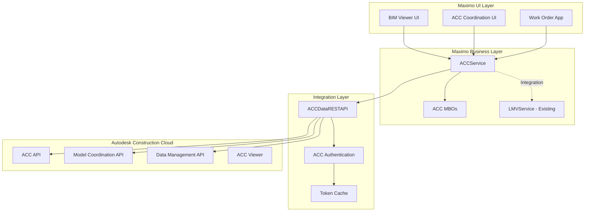
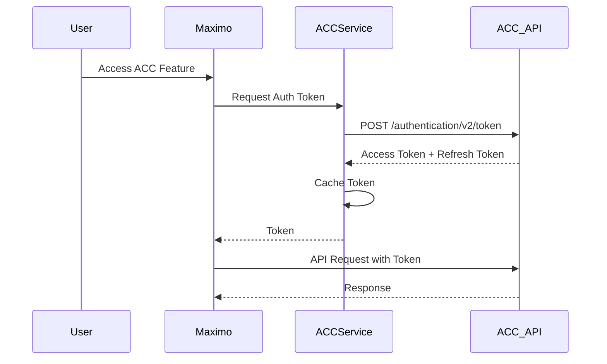

# Autodesk Construction Cloud (ACC) Model Coordination Plugin Architecture

## Executive Summary

This document outlines the architecture for a new Maximo plugin that integrates with the Autodesk Construction Cloud (ACC) API, specifically focusing on **Model Coordination** features. The architecture follows the established patterns from the existing Forge Viewer plugin ([`LMVService`](applications/maximo/businessobjects/src/psdi/app/bim/viewer/lmv/LMVService.java:52)) while adapting to ACC's modern API structure.

**Target Features:**
- Model coordination and clash detection
- Multi-model viewing and coordination
- Issue tracking integration with Maximo work orders
- Model version management
- Coordination space management

---

## 1. Architecture Overview

### 1.1 High-Level Architecture



### 1.2 Design Principles

Following the existing Forge plugin pattern:

1. **Service-Oriented Architecture**: Central [`ACCService`] extends [`AppService`](applications/maximo/businessobjects/src/psdi/app/bim/viewer/lmv/LMVService.java:52)
2. **REST API Abstraction**: [`ACCDataRESTAPI`] similar to [`DataRESTAPI`](applications/maximo/businessobjects/src/psdi/app/bim/viewer/dataapi/DataRESTAPI.java:60)
3. **Hybrid MBO Pattern**: Combine Maximo DB data with live ACC API data
4. **Token Management**: Secure OAuth 2.0 with token caching using [`ConcurrentHashMap`](applications/maximo/businessobjects/src/psdi/app/bim/viewer/dataapi/DataRESTAPI.java:243)
5. **Java 17 Modernization**: Leverage Records, sealed classes, and modern concurrency

---

## 2. Component Architecture

### 2.1 Core Service Layer

#### 2.1.1 ACCService (Main Service)

**Location**: `applications/maximo/businessobjects/src/psdi/app/bim/viewer/acc/ACCService.java`

**Pattern**: Follows [`LMVService`](applications/maximo/businessobjects/src/psdi/app/bim/viewer/lmv/LMVService.java:52)

```java
@WebService
public class ACCService extends AppService implements ACCServiceRemote {
    public final static String SERVICE_NAME = "BIMACC";
    public final static String VER = "v1";
    
    // Configuration properties
    public final static String ACC_CLIENT_ID     = "bim.viewer.ACC.clientId";
    public final static String ACC_CLIENT_SECRET = "bim.viewer.ACC.clientSecret";
    public final static String ACC_CALLBACK_URL  = "bim.viewer.ACC.callbackUrl";
    public final static String ACC_API_HOST      = "bim.viewer.ACC.host";
    
    private ACCDataRESTAPI _restAPI = null;
    private MXServer _mxServer = null;
    
    // Core Methods
    public ResultAuthentication authenticate(String[] scopes);
    public ResultProjectList projectList(String accountId);
    public ResultModelList modelList(String projectId);
    public ResultClashList clashList(String projectId, String modelSetId);
    public ResultIssueList issueList(String projectId);
    public Result createIssueFromWorkOrder(String projectId, MboRemote workOrder);
    public Result syncClashToWorkOrder(String clashId, String workOrderNum);
}
```

#### 2.1.2 ACCServiceRemote (Remote Interface)

**Location**: `applications/maximo/businessobjects/src/psdi/app/bim/viewer/acc/ACCServiceRemote.java`

**Pattern**: Follows [`LMVServiceRemote`](applications/maximo/businessobjects/src/psdi/app/bim/viewer/lmv/LMVServiceRemote.java:41)

```java
public interface ACCServiceRemote extends AppServiceRemote {
    // Authentication
    ResultAuthentication authenticate(String[] scopes) 
        throws IOException, URISyntaxException;
    
    // Project Management
    ResultProjectList projectList(String accountId) 
        throws IOException, URISyntaxException;
    ResultProjectDetail projectQueryDetails(String projectId) 
        throws IOException, URISyntaxException;
    
    // Model Coordination
    ResultModelList modelList(String projectId) 
        throws IOException, URISyntaxException;
    ResultModelSetList modelSetList(String projectId) 
        throws IOException, URISyntaxException;
    ResultClashList clashList(String projectId, String modelSetId) 
        throws IOException, URISyntaxException;
    ResultClashDetail clashQueryDetails(String projectId, String clashId) 
        throws IOException, URISyntaxException;
    
    // Issue Management
    ResultIssueList issueList(String projectId) 
        throws IOException, URISyntaxException;
    Result createIssue(String projectId, IssueData issueData) 
        throws IOException, URISyntaxException;
    Result updateIssue(String projectId, String issueId, IssueData issueData) 
        throws IOException, URISyntaxException;
    
    // Maximo Integration
    Result createIssueFromWorkOrder(String projectId, MboRemote workOrder) 
        throws RemoteException, MXException;
    Result syncClashToWorkOrder(String clashId, String workOrderNum) 
        throws RemoteException, MXException;
    MboSetRemote getLinkedClashes(UserInfo userInfo, String workOrderNum) 
        throws RemoteException, MXException;
}
```

---

### 2.2 REST API Layer

#### 2.2.1 ACCDataRESTAPI (Base REST Client)

**Location**: `applications/maximo/businessobjects/src/psdi/app/bim/viewer/dataapi/ACCDataRESTAPI.java`

**Pattern**: Extends/mirrors [`DataRESTAPI`](applications/maximo/businessobjects/src/psdi/app/bim/viewer/dataapi/DataRESTAPI.java:60)

```java
/**
 * Abstract base class for Autodesk Construction Cloud REST API integration.
 * Modernized for Java 17 with Records and enhanced concurrency.
 */
public abstract class ACCDataRESTAPI {
    // API Endpoints
    public final static int API_AUTH = 1;
    public final static int API_DATA_MGMT = 2;
    public final static int API_MODEL_COORD = 3;
    public final static int API_ISSUES = 4;
    
    // OAuth 2.0 Scopes
    public final static String SCOPE_DATA_READ = "data:read";
    public final static String SCOPE_DATA_WRITE = "data:write";
    public final static String SCOPE_ACCOUNT_READ = "account:read";
    public final static String SCOPE_ACCOUNT_WRITE = "account:write";
    
    // API Patterns (ACC uses different endpoints than Forge)
    protected final static String PATT_AUTH = "/authentication/v2/token";
    protected final static String PATT_PROJECTS = "/project/v1/hubs/%1/projects";
    protected final static String PATT_PROJECT_DETAIL = "/project/v1/hubs/%1/projects/%2";
    protected final static String PATT_MODELS = "/data/v1/projects/%1/items";
    protected final static String PATT_MODEL_SETS = "/modelcoordination/v1/containers/%1/modelsets";
    protected final static String PATT_CLASHES = "/modelcoordination/v1/containers/%1/clashes";
    protected final static String PATT_CLASH_DETAIL = "/modelcoordination/v1/containers/%1/clashes/%2";
    protected final static String PATT_ISSUES = "/issues/v1/containers/%1/quality-issues";
    
    // Java 17: Modern concurrency with ConcurrentHashMap
    private final Map<String, ACCAuthToken> authTokens = new ConcurrentHashMap<>();
    
    // Abstract methods for configuration
    public abstract String lookupClientId();
    public abstract String lookupClientSecret();
    public abstract String lookupCallbackUrl();
    public abstract String lookupHostname();
    public abstract boolean requestRights(String scope);
    
    // Core API Methods
    public ResultAuthentication authenticate(String[] scopes);
    public ResultProjectList projectList(String accountId);
    public ResultModelList modelList(String projectId);
    public ResultClashList clashList(String projectId, String modelSetId);
    public ResultIssueList issueList(String projectId);
}
```

#### 2.2.2 ACCServiceImpl (Concrete Implementation)

**Location**: `applications/maximo/businessobjects/src/psdi/app/bim/viewer/acc/ACCServiceImpl.java`

```java
public class ACCServiceImpl extends ACCDataRESTAPI {
    @Override
    public String lookupClientId() {
        return MXServer.getMXServer().getProperty(ACCService.ACC_CLIENT_ID);
    }
    
    @Override
    public String lookupClientSecret() {
        return MXServer.getMXServer().getProperty(ACCService.ACC_CLIENT_SECRET);
    }
    
    @Override
    public String lookupCallbackUrl() {
        return MXServer.getMXServer().getProperty(ACCService.ACC_CALLBACK_URL);
    }
    
    @Override
    public String lookupHostname() {
        String host = MXServer.getMXServer().getProperty(ACCService.ACC_API_HOST);
        return (host != null) ? host : "developer.api.autodesk.com";
    }
    
    @Override
    public boolean requestRights(String scope) {
        // Implement security checks based on Maximo user permissions
        return true; // Simplified - implement proper security
    }
}
```

---

### 2.3 Data Models (Java 17 Records)

#### 2.3.1 Authentication Models

**Location**: `applications/maximo/businessobjects/src/psdi/app/bim/viewer/dataapi/`

```java
/**
 * Java 17 Record for ACC OAuth 2.0 token
 * Immutable, thread-safe, with built-in validation
 */
public record ACCAuthToken(
    String accessToken,
    String refreshToken,
    Instant expiresAt,
    String tokenType,
    Set<String> scopes
) {
    // Compact constructor with validation
    public ACCAuthToken {
        Objects.requireNonNull(accessToken, "Access token cannot be null");
        Objects.requireNonNull(expiresAt, "Expiration time cannot be null");
        tokenType = (tokenType != null) ? tokenType : "Bearer";
        scopes = (scopes != null) ? Set.copyOf(scopes) : Set.of();
    }
    
    public boolean isExpired() {
        return Instant.now().isAfter(expiresAt);
    }
    
    public boolean isValid() {
        return !isExpired() && accessToken != null && !accessToken.isEmpty();
    }
    
    public String getAuthorizationHeader() {
        return tokenType + " " + accessToken;
    }
    
    public long getSecondsUntilExpiration() {
        return Duration.between(Instant.now(), expiresAt).getSeconds();
    }
}
```

#### 2.3.2 Project Models

```java
public record ACCProject(
    String id,
    String name,
    String accountId,
    String type,
    Instant createdAt,
    Instant updatedAt,
    Map<String, String> attributes
) {
    public ACCProject {
        Objects.requireNonNull(id, "Project ID cannot be null");
        Objects.requireNonNull(name, "Project name cannot be null");
        attributes = (attributes != null) ? Map.copyOf(attributes) : Map.of();
    }
}
```

#### 2.3.3 Model Coordination Models

```java
public record ACCModelSet(
    String id,
    String name,
    String projectId,
    List<String> modelIds,
    Instant createdAt,
    String status
) {
    public ACCModelSet {
        Objects.requireNonNull(id, "Model set ID cannot be null");
        modelIds = (modelIds != null) ? List.copyOf(modelIds) : List.of();
    }
}

public record ACCClash(
    String id,
    String name,
    String modelSetId,
    String status,
    String severity,
    List<String> elementIds,
    ACCClashLocation location,
    Instant detectedAt,
    String assignedTo
) {
    public ACCClash {
        Objects.requireNonNull(id, "Clash ID cannot be null");
        elementIds = (elementIds != null) ? List.copyOf(elementIds) : List.of();
    }
}

public record ACCClashLocation(
    double x,
    double y,
    double z,
    String viewpointUrn
) {}
```

#### 2.3.4 Issue Models

```java
public record ACCIssue(
    String id,
    String title,
    String description,
    String projectId,
    String status,
    String priority,
    String assignedTo,
    String issueType,
    ACCIssueLocation location,
    List<String> attachments,
    Instant createdAt,
    Instant dueDate
) {
    public ACCIssue {
        Objects.requireNonNull(id, "Issue ID cannot be null");
        attachments = (attachments != null) ? List.copyOf(attachments) : List.of();
    }
}

public record ACCIssueLocation(
    String modelUrn,
    List<String> elementIds,
    ACCViewpoint viewpoint
) {}

public record ACCViewpoint(
    double[] position,
    double[] target,
    double[] up,
    double fov
) {}
```

---

### 2.4 Result Classes

**Location**: `applications/maximo/businessobjects/src/psdi/app/bim/viewer/dataapi/`

**Pattern**: Follows existing result classes like [`ResultAuthentication`](applications/maximo/businessobjects/src/psdi/app/bim/viewer/dataapi/ResultAuthentication.java)

```java
public class ResultProjectList extends Result {
    private List<ACCProject> projects;
    private String nextPageToken;
    
    public List<ACCProject> getProjects() { return projects; }
    public void setProjects(List<ACCProject> projects) { this.projects = projects; }
    public String getNextPageToken() { return nextPageToken; }
    public void setNextPageToken(String token) { this.nextPageToken = token; }
}

public class ResultModelList extends Result {
    private List<ACCModel> models;
    private String nextPageToken;
    
    // Getters and setters
}

public class ResultClashList extends Result {
    private List<ACCClash> clashes;
    private int totalCount;
    private String nextPageToken;
    
    // Getters and setters
}

public class ResultIssueList extends Result {
    private List<ACCIssue> issues;
    private int totalCount;
    private String nextPageToken;
    
    // Getters and setters
}
```

---

## 3. Maximo Business Objects (MBO) Layer

### 3.1 ACC Project MBO

**Location**: `applications/maximo/businessobjects/src/psdi/app/bim/viewer/acc/ACCProject.java`

**Pattern**: Hybrid MBO like [`BucketRemote`](applications/maximo/businessobjects/src/psdi/app/bim/viewer/lmv/BucketRemote.java:26)

```java
public class ACCProject extends Mbo implements ACCProjectRemote {
    // Database fields
    public static final String TABLE_NAME = "ACCPROJECT";
    public static final String FIELD_ACCPROJECTID = "ACCPROJECTID";
    public static final String FIELD_PROJECTID = "PROJECTID";
    public static final String FIELD_ACCOUNTID = "ACCOUNTID";
    public static final String FIELD_PROJECTNAME = "PROJECTNAME";
    public static final String FIELD_SITEID = "SITEID";
    public static final String FIELD_ORGID = "ORGID";
    public static final String FIELD_LASTSYNCED = "LASTSYNCED";
    
    @Override
    public void init() throws MXException {
        super.init();
        // Initialize field validators
    }
    
    @Override
    public void attach() throws RemoteException, MXException {
        // Fetch live data from ACC API and populate fields
        ACCServiceRemote accService = getACCService();
        ResultProjectDetail result = accService.projectQueryDetails(
            getString(FIELD_ACCOUNTID),
            getString(FIELD_PROJECTID)
        );
        // Populate fields from result
    }
    
    @Override
    public void syncModels() throws RemoteException, MXException {
        // Sync models from ACC to Maximo
    }
    
    private ACCServiceRemote getACCService() throws MXException, RemoteException {
        return (ACCServiceRemote) MXServer.getMXServer().lookup(ACCService.SERVICE_NAME);
    }
}
```

### 3.2 ACC Model Set MBO

```java
public class ACCModelSet extends Mbo implements ACCModelSetRemote {
    public static final String TABLE_NAME = "ACCMODELSET";
    public static final String FIELD_MODELSETID = "MODELSETID";
    public static final String FIELD_ACCPROJECTID = "ACCPROJECTID";
    public static final String FIELD_MODELSETNAME = "MODELSETNAME";
    public static final String FIELD_STATUS = "STATUS";
    
    @Override
    public void runClashDetection() throws RemoteException, MXException {
        // Trigger clash detection via ACC API
    }
    
    @Override
    public MboSetRemote getClashes() throws RemoteException, MXException {
        // Return clashes for this model set
    }
}
```

### 3.3 ACC Clash MBO

```java
public class ACCClash extends Mbo implements ACCClashRemote {
    public static final String TABLE_NAME = "ACCCLASH";
    public static final String FIELD_CLASHID = "CLASHID";
    public static final String FIELD_MODELSETID = "MODELSETID";
    public static final String FIELD_CLASHNAME = "CLASHNAME";
    public static final String FIELD_STATUS = "STATUS";
    public static final String FIELD_SEVERITY = "SEVERITY";
    public static final String FIELD_WORKORDERID = "WORKORDERID";
    public static final String FIELD_ASSIGNEDTO = "ASSIGNEDTO";
    
    @Override
    public MboRemote createWorkOrder() throws RemoteException, MXException {
        // Create a Maximo work order from this clash
        MboSetRemote woSet = getMboSet("WORKORDER");
        MboRemote wo = woSet.add();
        wo.setValue("DESCRIPTION", getString(FIELD_CLASHNAME));
        wo.setValue("LOCATION", getClashLocation());
        // Link clash to work order
        setValue(FIELD_WORKORDERID, wo.getString("WORKORDERID"));
        return wo;
    }
    
    @Override
    public void syncStatus() throws RemoteException, MXException {
        // Sync status with ACC
    }
}
```

### 3.4 ACC Issue MBO

```java
public class ACCIssue extends Mbo implements ACCIssueRemote {
    public static final String TABLE_NAME = "ACCISSUE";
    public static final String FIELD_ISSUEID = "ISSUEID";
    public static final String FIELD_ACCPROJECTID = "ACCPROJECTID";
    public static final String FIELD_TITLE = "TITLE";
    public static final String FIELD_STATUS = "STATUS";
    public static final String FIELD_WORKORDERID = "WORKORDERID";
    
    @Override
    public void syncToACC() throws RemoteException, MXException {
        // Push changes to ACC
    }
    
    @Override
    public void syncFromACC() throws RemoteException, MXException {
        // Pull changes from ACC
    }
}
```

---

## 4. Database Schema

### 4.1 Core Tables

#### ACCPROJECT Table
```sql
CREATE TABLE ACCPROJECT (
    ACCPROJECTID    BIGINT NOT NULL,
    PROJECTID       VARCHAR(128) NOT NULL,
    ACCOUNTID       VARCHAR(128) NOT NULL,
    PROJECTNAME     VARCHAR(256),
    PROJECTTYPE     VARCHAR(64),
    SITEID          VARCHAR(8),
    ORGID           VARCHAR(8),
    DESCRIPTION     VARCHAR(512),
    LASTSYNCED      TIMESTAMP,
    CREATEDATE      TIMESTAMP,
    CHANGEDATE      TIMESTAMP,
    CHANGEBY        VARCHAR(30),
    PRIMARY KEY (ACCPROJECTID),
    UNIQUE (PROJECTID, SITEID)
);
```

#### ACCMODELSET Table
```sql
CREATE TABLE ACCMODELSET (
    MODELSETID      BIGINT NOT NULL,
    ACCPROJECTID    BIGINT NOT NULL,
    MODELSETNAME    VARCHAR(256),
    ACCMODELSETID   VARCHAR(128),
    STATUS          VARCHAR(32),
    LASTCLASHRUN    TIMESTAMP,
    CREATEDATE      TIMESTAMP,
    CHANGEDATE      TIMESTAMP,
    PRIMARY KEY (MODELSETID),
    FOREIGN KEY (ACCPROJECTID) REFERENCES ACCPROJECT(ACCPROJECTID)
);
```

#### ACCCLASH Table
```sql
CREATE TABLE ACCCLASH (
    CLASHID         BIGINT NOT NULL,
    MODELSETID      BIGINT NOT NULL,
    ACCCLASHID      VARCHAR(128),
    CLASHNAME       VARCHAR(256),
    STATUS          VARCHAR(32),
    SEVERITY        VARCHAR(32),
    WORKORDERID     BIGINT,
    ASSIGNEDTO      VARCHAR(30),
    LOCATIONX       DECIMAL(18,6),
    LOCATIONY       DECIMAL(18,6),
    LOCATIONZ       DECIMAL(18,6),
    VIEWPOINTURN    VARCHAR(512),
    DETECTEDDATE    TIMESTAMP,
    RESOLVEDDATE    TIMESTAMP,
    CREATEDATE      TIMESTAMP,
    CHANGEDATE      TIMESTAMP,
    PRIMARY KEY (CLASHID),
    FOREIGN KEY (MODELSETID) REFERENCES ACCMODELSET(MODELSETID),
    FOREIGN KEY (WORKORDERID) REFERENCES WORKORDER(WORKORDERID)
);
```

#### ACCISSUE Table
```sql
CREATE TABLE ACCISSUE (
    ISSUEID         BIGINT NOT NULL,
    ACCPROJECTID    BIGINT NOT NULL,
    ACCISSUEID      VARCHAR(128),
    TITLE           VARCHAR(256),
    DESCRIPTION     CLOB,
    STATUS          VARCHAR(32),
    PRIORITY        VARCHAR(32),
    ISSUETYPE       VARCHAR(64),
    WORKORDERID     BIGINT,
    ASSIGNEDTO      VARCHAR(30),
    DUEDATE         TIMESTAMP,
    CREATEDATE      TIMESTAMP,
    CHANGEDATE      TIMESTAMP,
    PRIMARY KEY (ISSUEID),
    FOREIGN KEY (ACCPROJECTID) REFERENCES ACCPROJECT(ACCPROJECTID),
    FOREIGN KEY (WORKORDERID) REFERENCES WORKORDER(WORKORDERID)
);
```

#### ACCMODEL Table
```sql
CREATE TABLE ACCMODEL (
    MODELID         BIGINT NOT NULL,
    ACCPROJECTID    BIGINT NOT NULL,
    ACCMODELID      VARCHAR(128),
    MODELNAME       VARCHAR(256),
    MODELURN        VARCHAR(512),
    VERSION         VARCHAR(32),
    FILETYPE        VARCHAR(32),
    FILESIZE        BIGINT,
    UPLOADDATE      TIMESTAMP,
    CREATEDATE      TIMESTAMP,
    PRIMARY KEY (MODELID),
    FOREIGN KEY (ACCPROJECTID) REFERENCES ACCPROJECT(ACCPROJECTID)
);
```

### 4.2 Database Scripts

**Location**: `tools/maximo/en/bimacc/`

**Pattern**: Follow [`bimlmv`](tools/maximo/en/bimlmv/) structure

Files needed:
- `V7610_01.dbc` - Initial table creation
- `V7610_02.dbc` - Indexes and constraints
- `V7610_03.mxs` - UI presentation updates
- `V7610_04.msg` - Message catalog
- `product.msg` - Product messages

---

## 5. UI Components

### 5.1 ACC Viewer Component

**Location**: `applications/maximo/maximouiweb/src/psdi/webclient/components/ACCViewer.java`

**Pattern**: Extends [`BIMViewer`](applications/maximo/maximouiweb/src/psdi/webclient/components/BIMViewer.java:87)

```java
public class ACCViewer extends BIMViewer {
    public final static String PROP_ACC_PROJECT_ID = "accprojectid";
    public final static String PROP_ACC_MODEL_SET_ID = "accmodelsetid";
    
    @Override
    public void initialize() {
        super.initialize();
        // Initialize ACC-specific viewer
    }
    
    public void loadModelSet(String modelSetId) {
        // Load ACC model set into viewer
    }
    
    public void highlightClash(String clashId) {
        // Highlight clash in viewer
    }
    
    public void showIssue(String issueId) {
        // Show issue in viewer with viewpoint
    }
}
```

### 5.2 JSP Components

**Location**: `applications/maximo/maximouiweb/webmodule/webclient/components/bimacc/`

Files needed:
- `header.jsp` - ACC viewer header
- `toolbar.jsp` - ACC-specific toolbar
- `footer.jsp` - ACC viewer footer
- `viewer.jsp` - Main viewer component

### 5.3 JavaScript Integration

**Location**: `applications/maximo/maximouiweb/webmodule/webclient/javascript/`

Files needed:
- `ACCViewer.js` - Main ACC viewer JavaScript
- `ACCModelCoordination.js` - Model coordination features
- `ACCClashDetection.js` - Clash detection UI

---

## 6. Configuration

### 6.1 Maximo Properties

Add to `maximo.properties`:

```properties
# ACC API Configuration
bim.viewer.ACC.clientId=YOUR_ACC_CLIENT_ID
bim.viewer.ACC.clientSecret=YOUR_ACC_CLIENT_SECRET
bim.viewer.ACC.callbackUrl=https://your-maximo-server/maximo/acc/callback
bim.viewer.ACC.host=developer.api.autodesk.com
bim.viewer.ACC.api.version=v1

# ACC Feature Flags
bim.viewer.ACC.modelcoordination.enabled=true
bim.viewer.ACC.clashdetection.enabled=true
bim.viewer.ACC.issues.enabled=true
bim.viewer.ACC.autosync.enabled=true
bim.viewer.ACC.autosync.interval=3600

# ACC Limits
bim.viewer.ACC.model.maxsize=5368709120
bim.viewer.ACC.clash.maxresults=1000
```

### 6.2 Product Definition

**Location**: `applications/maximo/properties/product/bimacc.xml`

**Pattern**: Follow [`bimlmv.xml`](applications/maximo/properties/product/bimlmv.xml:19)

```xml
<?xml version="1.0" encoding="UTF-8" ?>
<product>
    <name>IBM Maximo BIM Extensions - Autodesk Construction Cloud Plugin</name>
    <version>
        <major>1</major>
        <minor>0</minor>
        <modlevel>0</modlevel>
        <patch>0</patch>
        <build>20260203-0100</build>
    </version>
    <dbmaxvarname>BIMACC</dbmaxvarname>
    <dbscripts>bimacc</dbscripts>
    <dbversion>V7610-01</dbversion>
    <lastdbversion>V7610-01</lastdbversion>
</product>
```

---

## 7. Integration Points

### 7.1 Work Order Integration

```java
public class ACCWorkOrderIntegration {
    /**
     * Create work order from ACC clash
     */
    public static MboRemote createWorkOrderFromClash(
        ACCClashRemote clash,
        UserInfo userInfo
    ) throws RemoteException, MXException {
        MboSetRemote woSet = MXServer.getMXServer()
            .getMboSet("WORKORDER", userInfo);
        MboRemote wo = woSet.add();
        
        // Set work order fields from clash
        wo.setValue("DESCRIPTION", clash.getString("CLASHNAME"));
        wo.setValue("WORKTYPE", "CM"); // Corrective Maintenance
        wo.setValue("PRIORITY", mapSeverityToPriority(clash.getString("SEVERITY")));
        
        // Link to location if available
        String location = clash.getClashLocation();
        if (location != null) {
            wo.setValue("LOCATION", location);
        }
        
        // Store clash reference
        wo.setValue("ACCCLASHID", clash.getString("CLASHID"));
        
        return wo;
    }
    
    /**
     * Sync work order status back to ACC issue
     */
    public static void syncWorkOrderToACCIssue(
        MboRemote workOrder,
        ACCServiceRemote accService
    ) throws RemoteException, MXException {
        String issueId = workOrder.getString("ACCISSUEID");
        if (issueId != null) {
            String status = mapWorkOrderStatusToACCStatus(
                workOrder.getString("STATUS")
            );
            accService.updateIssue(
                workOrder.getString("ACCPROJECTID"),
                issueId,
                new IssueData().withStatus(status)
            );
        }
    }
}
```

### 7.2 Asset/Location Integration

```java
public class ACCAssetIntegration {
    /**
     * Link ACC model elements to Maximo assets
     */
    public static void linkElementToAsset(
        String elementId,
        String assetNum,
        String siteId
    ) throws RemoteException, MXException {
        // Create link in ACCELEMENTASSET table
    }
    
    /**
     * Find assets affected by clash
     */
    public static List<MboRemote> findAffectedAssets(
        ACCClashRemote clash
    ) throws RemoteException, MXException {
        // Query assets linked to clash elements
        return new ArrayList<>();
    }
}
```

---

## 8. Security & Authentication

### 8.1 OAuth 2.0 Flow



### 8.2 Token Management

```java
public class ACCTokenManager {
    private final Map<String, ACCAuthToken> tokenCache = new ConcurrentHashMap<>();
    private final ScheduledExecutorService refreshScheduler = 
        Executors.newScheduledThreadPool(1);
    
    public ACCAuthToken getToken(String[] scopes) {
        String key = String.join(",", scopes);
        ACCAuthToken token = tokenCache.get(key);
        
        if (token == null || token.isExpired()) {
            token = refreshToken(scopes);
            tokenCache.put(key, token);
            scheduleRefresh(key, token);
        }
        
        return token;
    }
    
    private void scheduleRefresh(String key, ACCAuthToken token) {
        long delay = token.getSecondsUntilExpiration() - 300; // 5 min buffer
        refreshScheduler.schedule(() -> {
            try {
                ACCAuthToken newToken = refreshToken(token.scopes().toArray(new String[0]));
                tokenCache.put(key, newToken);
                scheduleRefresh(key, newToken);
            } catch (Exception e) {
                // Log error
            }
        }, delay, TimeUnit.SECONDS);
    }
}
```

---

## 9. Implementation Phases

### Phase 1: Foundation (Weeks 1-2)
- [x] Architecture design and review
- [ ] Set up project structure
- [ ] Create base service classes ([`ACCService`], [`ACCDataRESTAPI`])
- [ ] Implement authentication and token management
- [ ] Create Java 17 Record models
- [ ] Set up database schema

### Phase 2: Core API Integration (Weeks 3-4)
- [ ] Implement project management APIs
- [ ] Implement model coordination APIs
- [ ] Implement clash detection APIs
- [ ] Create result classes
- [ ] Add error handling and logging
- [ ] Write unit tests

### Phase 3: MBO Layer (Weeks 5-6)
- [ ] Create ACC MBOs ([`ACCProject`], [`ACCModelSet`], [`ACCClash`], [`ACCIssue`])
- [ ] Implement hybrid data pattern
- [ ] Add validation and business logic
- [ ] Create MBO sets and relationships
- [ ] Write integration tests

### Phase 4: UI Integration (Weeks 7-8)
- [ ] Create ACC viewer component
- [ ] Implement JSP pages
- [ ] Add JavaScript integration
- [ ] Create toolbars and controls
- [ ] Implement clash visualization
- [ ] Add issue management UI

### Phase 5: Maximo Integration (Weeks 9-10)
- [ ] Work order integration
- [ ] Asset/location linking
- [ ] Saved views integration
- [ ] Markup support
- [ ] Event listeners
- [ ] Synchronization logic

### Phase 6: Testing & Documentation (Weeks 11-12)
- [ ] Comprehensive testing
- [ ] Performance optimization
- [ ] Security audit
- [ ] User documentation
- [ ] API documentation
- [ ] Deployment guide

---

## 10. File Structure

```
MAXIMOFORGEVIEWERPLUGIN_Java17/
├── applications/
│   └── maximo/
│       ├── businessobjects/
│       │   └── src/psdi/app/bim/viewer/
│       │       ├── acc/
│       │       │   ├── ACCService.java
│       │       │   ├── ACCServiceRemote.java
│       │       │   ├── ACCServiceImpl.java
│       │       │   ├── ACCProject.java
│       │       │   ├── ACCProjectRemote.java
│       │       │   ├── ACCProjectSet.java
│       │       │   ├── ACCModelSet.java
│       │       │   ├── ACCModelSetRemote.java
│       │       │   ├── ACCClash.java
│       │       │   ├── ACCClashRemote.java
│       │       │   ├── ACCIssue.java
│       │       │   ├── ACCIssueRemote.java
│       │       │   ├── ACCModel.java
│       │       │   └── ACCModelRemote.java
│       │       └── dataapi/
│       │           ├── ACCDataRESTAPI.java
│       │           ├── ACCAuthToken.java (Record)
│       │           ├── ACCProject.java (Record)
│       │           ├── ACCModelSet.java (Record)
│       │           ├── ACCClash.java (Record)
│       │           ├── ACCIssue.java (Record)
│       │           ├── ResultProjectList.java
│       │           ├── ResultModelList.java
│       │           ├── ResultClashList.java
│       │           └── ResultIssueList.java
│       ├── maximouiweb/
│       │   ├── src/psdi/webclient/components/
│       │   │   └── ACCViewer.java
│       │   └── webmodule/webclient/
│       │       ├── components/bimacc/
│       │       │   ├── header.jsp
│       │       │   ├── toolbar.jsp
│       │       │   ├── footer.jsp
│       │       │   └── viewer.jsp
│       │       └── javascript/
│       │           ├── ACCViewer.js
│       │           ├── ACCModelCoordination.js
│       │           └── ACCClashDetection.js
│       └── properties/
│           ├── product/
│           │   └── bimacc.xml
│           └── registry-extensions/
│               ├── acc-component-registry.xml
│               └── acc-control-registry.xml
├── tools/
│   └── maximo/
│       └── en/bimacc/
│           ├── V7610_01.dbc
│           ├── V7610_02.dbc
│           ├── V7610_03.mxs
│           ├── V7610_04.msg
│           └── product.msg
├── Doc/
│   ├── ACC_Plugin_Install_Guide.pdf
│   ├── ACC_Plugin_User_Guide.pdf
│   └── ACC_API_Integration.pdf
└── ACC_PLUGIN_ARCHITECTURE.md (this file)
```

---

## 11. Key Differences: ACC vs Forge

| Aspect | Forge (LMV) | ACC |
|--------|-------------|-----|
| **Authentication** | 2-legged OAuth | 3-legged OAuth 2.0 |
| **API Base** | `developer.api.autodesk.com` | `developer.api.autodesk.com` |
| **Storage** | OSS Buckets | ACC Projects |
| **Model Management** | Manual upload/translate | Integrated with ACC |
| **Clash Detection** | Not native | Native API support |
| **Issues** | Not native | Native issue tracking |
| **Viewer** | Forge Viewer | ACC Viewer (Forge-based) |
| **Scopes** | Bucket/data scopes | Account/project scopes |

---

## 12. Testing Strategy

### 12.1 Unit Tests

```java
@Test
public void testACCAuthentication() {
    ACCServiceImpl service = new ACCServiceImpl();
    String[] scopes = {ACCDataRESTAPI.SCOPE_DATA_READ};
    ResultAuthentication result = service.authenticate(scopes);
    
    assertNotNull(result);
    assertTrue(result.isSuccess());
    assertNotNull(result.getAccessToken());
}

@Test
public void testACCAuthTokenRecord() {
    ACCAuthToken token = new ACCAuthToken(
        "test_token",
        "refresh_token",
        Instant.now().plusSeconds(3600),
        "Bearer",
        Set.of("data:read")
    );
    
    assertTrue(token.isValid());
    assertFalse(token.isExpired());
    assertEquals("Bearer test_token", token.getAuthorizationHeader());
}
```

### 12.2 Integration Tests

```java
@Test
public void testClashToWorkOrderIntegration() {
    // Create test clash
    ACCClashRemote clash = createTestClash();
    
    // Create work order from clash
    MboRemote wo = ACCWorkOrderIntegration.createWorkOrderFromClash(
        clash, 
        testUserInfo
    );
    
    assertNotNull(wo);
    assertEquals(clash.getString("CLASHNAME"), wo.getString("DESCRIPTION"));
    assertEquals(clash.getString("CLASHID"), wo.getString("ACCCLASHID"));
}
```

---

## 13. Performance Considerations

### 13.1 Caching Strategy

```java
public class ACCCacheManager {
    private final Cache<String, ACCProject> projectCache = 
        CacheBuilder.newBuilder()
            .maximumSize(1000)
            .expireAfterWrite(1, TimeUnit.HOURS)
            .build();
    
    private final Cache<String, List<ACCClash>> clashCache = 
        CacheBuilder.newBuilder()
            .maximumSize(500)
            .expireAfterWrite(15, TimeUnit.MINUTES)
            .build();
}
```

### 13.2 Async Operations

```java
public class ACCAsyncOperations {
    private final ExecutorService executor = 
        Executors.newFixedThreadPool(10);
    
    public CompletableFuture<ResultClashList> runClashDetectionAsync(
        String projectId,
        String modelSetId
    ) {
        return CompletableFuture.supplyAsync(() -> {
            try {
                return accService.clashList(projectId, modelSetId);
            } catch (Exception e) {
                throw new CompletionException(e);
            }
        }, executor);
    }
}
```

---

## 14. Deployment

### 14.1 Build Process

```bash
# Build the ACC plugin
cd /Users/clydeicuspit/MAXIMOFORGEVIEWERPLUGIN_Java17
mvn clean package -P acc-plugin

# Generate deployment package
./make_acc_package.cmd

# Output: bimacc_v1.0.0.zip
```

### 14.2 Installation Steps

1. **Backup Maximo**
2. **Stop Maximo**
3. **Deploy ACC plugin**
   ```bash
   unzip bimacc_v1.0.0.zip -d $MAXIMO_HOME
   ```
4. **Update database**
   ```bash
   cd $MAXIMO_HOME/tools/maximo
   updatedb.sh
   ```
5. **Configure properties**
   - Add ACC credentials to `maximo.properties`
6. **Build and deploy EAR**
7. **Start Maximo**
8. **Verify installation**

---

## 15. Monitoring & Logging

### 15.1 Logging Configuration

```java
public class ACCLogger {
    private static final Logger logger = 
        Logger.getLogger(ACCService.class.getName());
    
    public static void logAPICall(String endpoint, String method) {
        logger.info(String.format(
            "ACC API Call: %s %s", 
            method, 
            endpoint
        ));
    }
    
    public static void logError(String operation, Exception e) {
        logger.severe(String.format(
            "ACC Error in %s: %s", 
            operation, 
            e.getMessage()
        ));
    }
}
```

### 15.2 Metrics

- API call latency
- Token refresh rate
- Clash detection frequency
- Work order creation rate
- Sync success/failure rate

---

## 16. Future Enhancements

### 16.1 Planned Features

1. **Real-time Collaboration**
   - Live clash updates
   - Multi-user coordination
   - Change notifications

2. **Advanced Analytics**
   - Clash trend analysis
   - Model quality metrics
   - Coordination efficiency reports

3. **Mobile Support**
   - Mobile clash review
   - Field issue creation
   - Offline sync

4. **AI/ML Integration**
   - Automated clash classification
   - Predictive maintenance from clashes
   - Smart work order assignment

### 16.2 API Extensions

- Support for ACC Cost Management
- Integration with ACC Docs
- Support for ACC Takeoff
- Integration with ACC Build

---

## 17. References

### 17.1 Autodesk Documentation

- [ACC API Documentation](https://aps.autodesk.com/en/docs/acc/v1/overview/)
- [Model Coordination API](https://aps.autodesk.com/en/docs/acc/v1/reference/http/mc-modelset-index-GET/)
- [Issues API](https://aps.autodesk.com/en/docs/acc/v1/reference/http/issues-issues-GET/)
- [Authentication Guide](https://aps.autodesk.com/en/docs/oauth/v2/tutorials/get-3-legged-token/)

### 17.2 Internal Documentation

- [`README.md`](README.md) - Original Forge plugin documentation
- [`README_JAVA17.md`](README_JAVA17.md) - Java 17 migration guide
- [`MIGRATION_GUIDE.md`](MIGRATION_GUIDE.md) - Migration documentation

### 17.3 Code References

- [`LMVService.java`](applications/maximo/businessobjects/src/psdi/app/bim/viewer/lmv/LMVService.java:52) - Service pattern
- [`DataRESTAPI.java`](applications/maximo/businessobjects/src/psdi/app/bim/viewer/dataapi/DataRESTAPI.java:60) - REST API pattern
- [`BIMViewer.java`](applications/maximo/maximouiweb/src/psdi/webclient/components/BIMViewer.java:87) - UI component pattern

---

## 18. Conclusion

This architecture provides a comprehensive blueprint for integrating Autodesk Construction Cloud's Model Coordination features into Maximo. By following the established patterns from the Forge Viewer plugin and leveraging Java 17's modern features, we can create a robust, maintainable, and performant integration.

**Key Benefits:**
